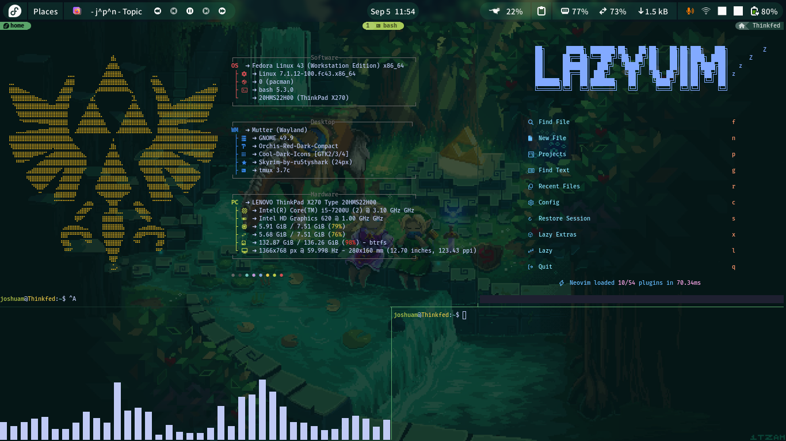

# Dotfiles Repository

These are my dotfiles. They're in git mostly so I can get a new machine running without redoing everything by hand, and so I can roll things back when I break something. If any of it is useful to you, take it.

GNU Stow does the symlinking. I run Fedora, so parts of this assume that.



## Requirements

- stow

```bash
sudo dnf install stow
```

## Restoring/Installing Dotfiles into New Machine

Clone the repository with the `--recursive` flag to ensure all submodules (plugins/themes) are included:

```bash
git clone --recursive https://github.com/JoshuaHM-p4/dotfiles-fedora.git ~/.dotfiles
cd ~/.dotfiles
```

Then stow each configuration directory to create symlinks in the home directory:

```bash
stow */
```

or (doing it one by one for more control):

```bash
stow nvim
stow tmux
#...
```

This pulls in any plugins or themes managed as submodules (e.g., Alacritty themes, tmux plugin manager):

```bash
git submodule update --init --recursive
```

## Structure

- `nvim/` → Neovim configuration (linked to ~/.config/nvim)
- `tmux/` → tmux configuration (~/.tmux.conf and plugins)
- `alacritty/` → Alacritty terminal settings (~/.config/alacritty)
- `vim/` → Vim configuration (linked to ~/.vimrc and ~/.vim)
- `bash/` → Bash configuration (~/.bashrc )
- `fastfetch/` → Fastfetch configuration (~/.config/fastfetch)
- `discordo/` → Discordo configuration (~/.config/discordo)
- `workmux/` → workmux configuration (~/.config/workmux)
